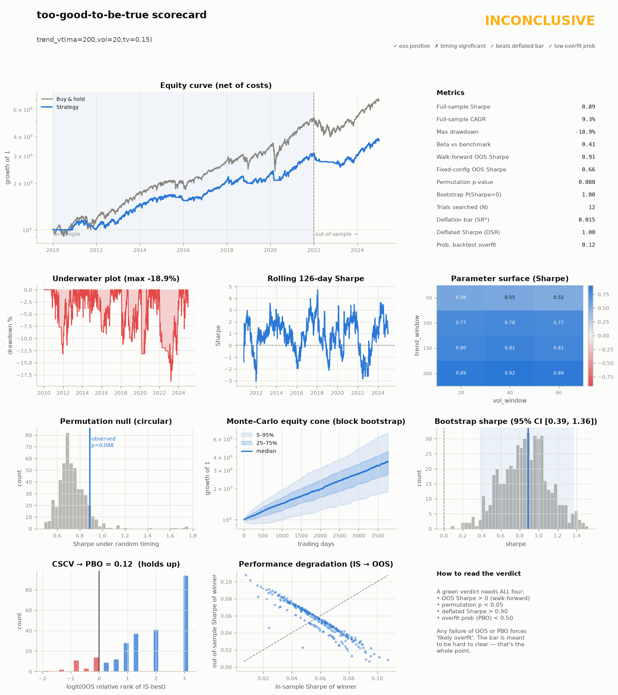

# too-good-to-be-true-backtester

> If a backtest looks too good to be true, this framework tells you *why*.

A strategy-validation harness built around one uncomfortable fact: **most backtested
"edges" are overfitting artefacts.** You hand it a trading strategy; it runs the full
gauntlet — out-of-sample splits, walk-forward re-fitting, parameter-robustness surfaces,
permutation / random-timing nulls, Monte-Carlo confidence cones, and a multiple-testing
correction — then returns a plain-English **verdict**: *real edge, overfit, or inconclusive.*

The design bias throughout is toward **honesty over optimism**. Look-ahead is prevented
structurally (a strategy physically never sees future bars); transaction costs are on from
the first backtest; and the headline metric is a Sharpe *deflated* for how many
configurations were tried.

## Why this exists

Anyone can produce a beautiful equity curve by tuning parameters until the past looks
profitable. The hard — and genuinely valuable — skill is telling a real signal apart from a
lucky fit. This repo is a toolkit for exactly that question, and a demonstration of the
research discipline that separates a durable strategy from a data-mined mirage.

## Status

All phases built and tested:

- [x] **Phase 0** — data layer, causal backtest engine, cost model, core metrics, first strategy
- [x] **Phase 1** — trend / vol-target strategy, in-sample / out-of-sample split, plots
- [x] **Phase 2** — validation core: walk-forward, parameter surface, permutation & random-timing nulls, Monte-Carlo
- [x] **Phase 3** — deflated Sharpe (multiple-testing correction), CSCV → probability of backtest overfitting
- [x] **Phase 4** — auto-generated overfit scorecard report + example strategies

## Example output

The scorecard runs the full gauntlet and renders a single verdict. Same framework, two
strategies on SPY (2010–2024, in-sample ≤ 2021, out-of-sample 2022+):



**Trend + volatility targeting → `INCONCLUSIVE`.** Sharpe 0.89, walk-forward out-of-sample
Sharpe 0.91, low overfit probability (PBO 0.12), and it roughly halves the drawdown of
buy-and-hold. But the permutation p-value is 0.088 — the *timing* isn't quite distinguishable
from a random-timing strategy with the same exposure — so the harness declines to call it a
real edge. It also underperforms buy-and-hold on total return: a lower-drawdown, not a
higher-return, story.

**Short-horizon mean reversion → `LIKELY OVERFIT`.** A pretty in-sample curve, but PBO 0.61
and a deflated Sharpe of 0.79 — the search is more likely fitting noise than finding signal.
(See [`docs/scorecard_meanrev.png`](docs/scorecard_meanrev.png).)

That an honestly-built framework returns "inconclusive / overfit" rather than a fantasy Sharpe
is the entire point.

## Design principles

1. **No look-ahead, by construction.** The engine controls the clock; a strategy is only
   ever handed data up to time *t* and its weights are applied at *t+1*. Leakage isn't
   discouraged — it's made impossible by the interface.
2. **Costs from the start.** Turnover-based transaction costs are applied in every backtest,
   because an event-driven edge that ignores costs isn't an edge.
3. **Assume you're fooling yourself.** Every result is checked against a null (random timing /
   permuted signals) and corrected for the number of trials.

## Quick start

```bash
python -m venv .venv && source .venv/bin/activate
pip install -e .
python examples/phase0_smoke.py      # data -> engine -> metrics sanity check
python examples/run_scorecard.py     # full overfit scorecards on SPY -> docs/*.png
```

Scoring your own strategy is a few lines:

```python
from tgtbt.data import get_prices
from tgtbt.strategies import TrendVolTarget, make_trend_vt, BuyAndHold
from tgtbt.reporting.scorecard import run_scorecard

prices = get_prices("SPY", start="2010-01-01", end="2024-12-31")
benchmark = BuyAndHold().backtest(prices).net_returns
grid = {"trend_window": [50, 100, 150, 200], "vol_window": [20, 40, 60], "target_vol": [0.15]}

card = run_scorecard(TrendVolTarget(trend_window=200), make_trend_vt, grid,
                     prices, benchmark=benchmark, split_date="2021-12-31")
print(card.verdict)          # 'likely real edge' | 'inconclusive' | 'likely overfit'
card.figure().savefig("scorecard.png")
```

Write a new strategy by subclassing `Strategy` and implementing one method,
`generate_weights(prices) -> weights`, using only backward-looking windows.

## Layout

```
tgtbt/
  data.py            # price fetch (yfinance) + parquet cache + synthetic fallback
  costs.py           # turnover-based transaction-cost model
  engine.py          # causal weights -> portfolio-returns backtester
  metrics.py         # CAGR, Sharpe, Sortino, max drawdown, Calmar, alpha/beta
  strategies/        # Strategy base + buy&hold, trend/vol-target, mean-reversion, dual-momentum
  validation/        # walk-forward, robustness surface, permutation, Monte-Carlo,
                     #   deflated Sharpe (PSR/DSR), CSCV -> PBO
  reporting/         # chart builders + the composed overfit scorecard
examples/            # runnable end-to-end scripts
tests/               # look-ahead leak test, engine correctness, validation-stat checks
docs/                # committed example scorecard figures
```

## Caveats (read these)

- **Daily data, vectorised engine.** Not an order-book simulator — appropriate for
  daily-rebalanced strategies, not HFT.
- **Survivorship bias.** `yfinance` returns today's listings; prefer liquid ETFs and treat
  single-name universes with caution.
- This is a **research and educational** tool for judging strategies, not investment advice.
